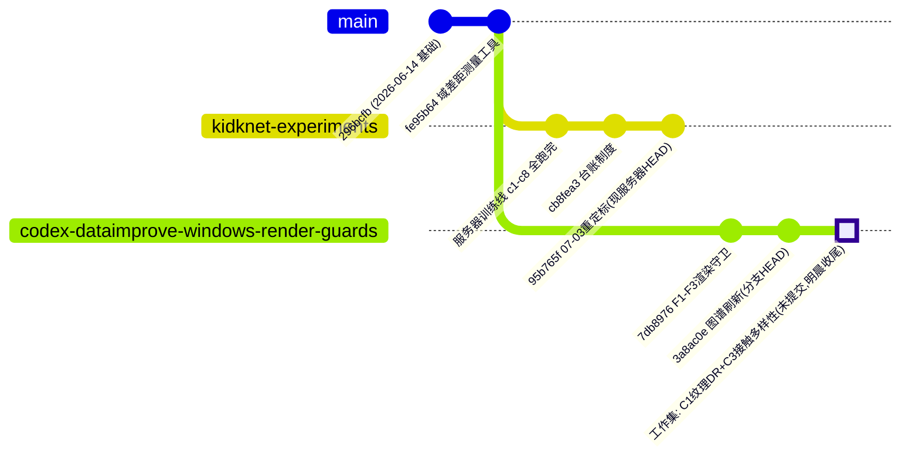

# MedSim2Learn 分支路线图（架构把控视图）

维护制度：随项目推进更新（所有者 2026-08-10 设立）。本版：2026-08-13。
细粒度路线终态见 `handoff/ROUTES.md`（R1–R25 台账）；服务器实验台账见
`experiments/INDEX.md`（kidknet-experiments 分支内）。

## 分支现状与归宿

| 分支 | 位置 | 状态 | 归宿 |
|---|---|---|---|
| `master` | 本地+origin @ **57f5897**（2026-08-13 晨收尾链已执行） | 干净；含 C1/C3 全部工作 + 胜负门条款成文 | 主干 |
| `codex/dataimprove-windows-render-guards` | @ 3d7db9e，已全量并入 master（快进） | **胜负门已过的优胜线，收尾完成** | 分支保留为收纳锚，可按所有者指示删除 |
| `kidknet-experiments` | 服务器 @ 95b765f（领先 origin 本地提交若干） | 历史实验线 = 验证试金石（所有者裁定非当前工作范围） | 保持服务器侧演进；台账入 experiments/INDEX.md |
| `r25` (9c74cf0) / R 路线群 / `codex/domain-gap-metrics` (77f8252) 等 | 本地归档分支（38→7 worktree 收纳后保留引用） | 终态见 ROUTES.md（CLOSED/LIMITED/FAIL/SUPERSEDED/FROZEN） | 永久本地归档，胜负门规则下不推送 |

## 证据链（Gap 胜负门）

| 层级 | 实验 | 裁决 | 数值 |
|---|---|---|---|
| 特征级 | 域差距探针 | 方向性通过 | 合成多样性 RMS：白模 16% → DR-C1 72% → 组合 **93%**（占真实比）；分离比累计 −42.5% |
| 训练级 1 | DR-C2-20260811（C1 单因子） | **有效**（折3 多种子复测后 5/5） | 差距闭合率 **39.6%** |
| 训练级 2 | C1C3-C2-20260812（组合） | **有效**（5/5 干净过线） | 差距闭合率 **60.6%**（pooled 0.6755±0.102） |
| 边际 | C3 对 DR-C1 | **终裁"不可判定"**（折0 复测后严格 5/5 未达成；2026-08-13） | 4/5 改善、pooled 边际 −0.236 远超噪声；折0 seed-mean 反号 +0.024 在噪声内——最终配方待所有者裁定 |

角度误差按所有者 2026-08-11 裁定暂不入判定（另寻感知方法，独立线）。

## 在跑与待决

- **在跑**：无（SEEDCHECK-FOLD0 已于 2026-08-13 晨结案，四运行全 rc=0，四卡空闲）。
- **待决**：最终配方裁定（DR-C1 单因子 或 C1+C3 组合——pooled 证据强烈偏向组合）；handoff/ 与 RESEARCH_*.md 是否入库待所有者另行指示。
- **收尾链已执行（2026-08-13 晨）**：32953f1（C1 特性）→ c635eee（C3 特性）→ 6590bf9（训练清单与回执）→ 3d7db9e（忽略规则+图谱）→ 快进合并 → 57f5897（规则成文）→ **push origin master 完成**。
- 未入库待所有者另行指示：`handoff/`（含本图与 ROUTES.md）、RESEARCH_GOAL/DIRECTION.md（保护文件）。
