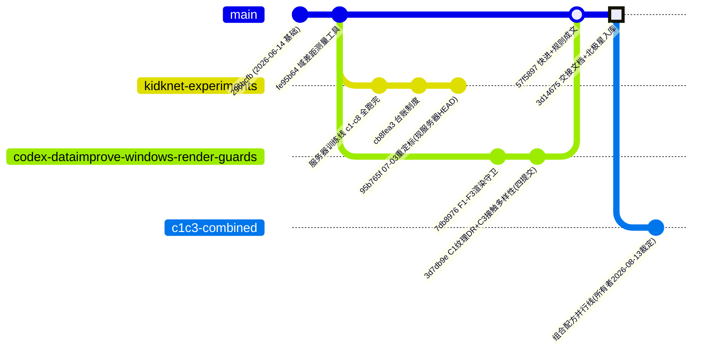

# MedSim2Learn 分支路线图（架构把控视图）

维护制度：随项目推进更新（所有者 2026-08-10 设立）。本版：2026-08-13（第二版：配方双线制 + 分支清理后）。
细粒度路线终态见 `handoff/ROUTES.md`（R1–R25 台账）；服务器实验台账见
`experiments/INDEX.md`（kidknet-experiments 分支内）。

## 分支现状与归宿（2026-08-13 清理后：12 分支 / 2 工作树）

| 分支 | 状态 | 角色与归宿 |
|---|---|---|
| `master` | 本地+origin @ 3d14675 | 主干；**正典数据配方 = DR-C1 单因子**（39.6%，证据链最严格）；含 C1/C3 全部工具与交接文档 |
| `c1c3-combined` | 本地+origin @ 3d14675（工作树 D:\MedSim2Learn-Windows-Render-Guards） | **组合配方并行线**（60.6%）；独立发展，潜力确证后择机并入 master，此前保持独立（所有者 2026-08-13 裁定） |
| `DataImprove` | @ 4482526 | 七月屏筛线（R6/R7）设计与报告的唯一文档记录 |
| `codex/dataimprove-c1-r19/r23/r25` | 各终态 | 证据/提取溯源锚（master 中提取件的哈希验证源 9c74cf0/9d3011f 在 r25/r23 上） |
| `codex/dataimprove-c1-r2` + `-pbr-validation` | 终态 | PBR 方向技术上开放（对应镜面高光残差，可能续投）|
| `codex/dataimprove-c1-r5-multiview` + `-view-coral-factorial` | 终态 | C2 视角单因子消融（未做事项）的设计前身 |
| `codex/dataimprove-windows-render-guards` | @ 3d7db9e，已全量并入 master | 优胜线历史标签 |
| `codex/domain-gap-metrics` | @ 77f8252 | MMD² 度量工具，供测量卫生批复用 |

**已清理（2026-08-13，所有者规则"同等级赛马淘汰方案清理掉"）**：32 个淘汰分支删除
（R1/R3/R4/R6–R16/R20–R22/R24 竞赛臂与被取代线；终态结论均在 ROUTES.md），5 个锚工作树移除
（删除前逐一核实 0 脏文件）。恢复束：`D:/MedSim2Learn-archive/retired-branches-20260813.bundle`（4.4MB，含全部被删分支尖）。

## 证据链（Gap 胜负门）

| 层级 | 实验 | 裁决 | 数值 |
|---|---|---|---|
| 特征级 | 域差距探针 | 方向性通过 | 合成多样性 RMS：白模 16% → DR-C1 72% → 组合 **93%**（占真实比）；分离比累计 −42.5% |
| 训练级 1 | DR-C2-20260811（C1 单因子） | **有效**（折3 多种子复测后 5/5） | 差距闭合率 **39.6%** |
| 训练级 2 | C1C3-C2-20260812（组合） | **有效**（5/5 干净过线） | 差距闭合率 **60.6%**（pooled 0.6755±0.102） |
| 边际 | C3 对 DR-C1 | **终裁"不可判定"**（折0 复测后严格 5/5 未达成；2026-08-13） | 4/5 改善、pooled 边际 −0.236 远超噪声；折0 seed-mean 反号 +0.024 在噪声内——最终配方待所有者裁定 |

角度误差按所有者 2026-08-11 裁定暂不入判定（另寻感知方法，独立线）。

## 在跑与待决

- **在跑**：无（SEEDCHECK-FOLD0 已于 2026-08-13 晨结案，四运行全 rc=0，四卡空闲）。
- **已裁定（2026-08-13）**：配方双线制（master=DR-C1 正典，c1c3-combined=组合并行线）；handoff/ 与 RESEARCH_*.md 已入库随发展维护；磁盘回收已执行（服务器释放约 59G，评估报告与两线 best_model 保留）；下一步数据侧优化方案由文献调研（限 JCR 2区 / CCF-A/B，排除 MDPI 类出版社）产出后交所有者遴选。
- **收尾链已执行（2026-08-13 晨）**：32953f1（C1 特性）→ c635eee（C3 特性）→ 6590bf9（训练清单与回执）→ 3d7db9e（忽略规则+图谱）→ 快进合并 → 57f5897（规则成文）→ **push origin master 完成**。
